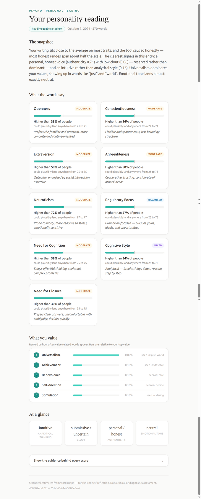

# Psycho

<p align="center">
  
</p>

A small Go service that extracts the psychological structure of a person from their writing and presents it with full auditability: every trait, cognitive label, and value assignment is traceable to specific linguistic evidence, with explicit confidence levels.

Inference is dictionary-based (LIWC-style), no LLM in the core inference path. Single-user, no auth, everything runs in one process against an embedded SQLite database.

## Features

* Text ingestion from a directory, with normalisation and segmentation
* Psycholinguistic feature extraction against a bundled dictionary
* Trait inference: Big Five (OCEAN), Regulatory Focus, Need for Cognition, Need for Closure, cognitive style, and Schwartz value orientations
* Confidence intervals on every score
* Structured JSON output and PDF report export (`GET /analysis/{id}/pdf`)
* Single-report browser flow (Tailwind + HTMX): paste text at the root URL, the report swaps in on the same page, download it as PDF. Every score ships with its evidence trail, and self-writing consent is required
* Config file path overridable via `PSYCHO_CONFIG`

## Getting started

Requires Go 1.27.

```sh
make build   # go build ./...
make run     # go run ./cmd/psycho/ (serves on :8080)
make test    # go test ./... -v
```

Config lives in `config/config.yaml` (port, dictionary path, DB path, sample dir). With the server running:

```sh
make test-curl            # POSTs the configured samples dir to /analyze-dir
make pdf ID=<analysis_id> # downloads the PDF report for a saved analysis
```

## Container (Podman)

```sh
make up     # podman build + run on :8080
make down   # stop and remove the container
```

## Documentation

* [docs/overview.md](docs/overview.md): plain-language tour of what Psycho does and how to read a report
* [docs/prd.md](docs/prd.md): product requirements (goal, non-goals, constraints, core features)
* [docs/system-design.md](docs/system-design.md): architecture, storage, module boundaries, and the research references each inference is based on
